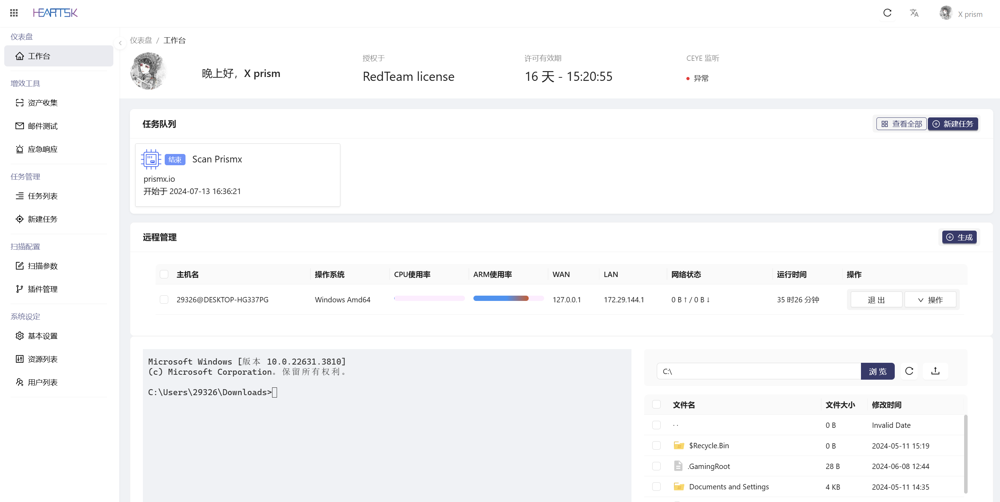
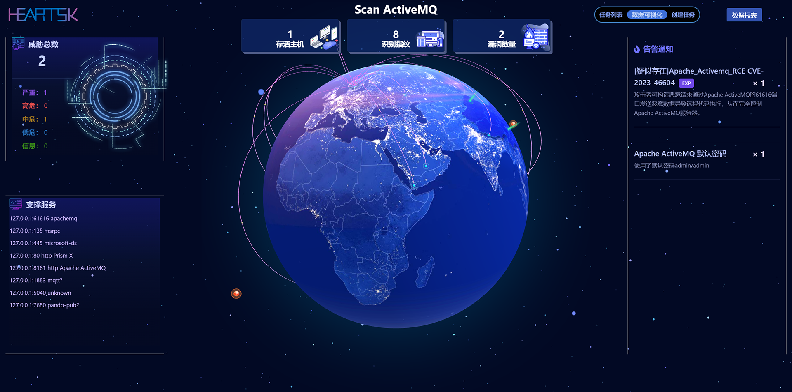

# :: 棱镜 X · 一体化的轻量型跨平台渗透系统

---

<p align="center">
  <a href="https://prismx.io/guide" target="_blank">使用文档</a> ·
  <a href="">主机管理</a> ·
  <a href="">风险扫描</a> ·
  <a href="">漏洞利用</a> ·
  <a href="">应急辅助</a>
</p>

## 启动

### · WEB 系统

下载对应 OS ARCH 的软件包 [Prism X releases](https://github.com/yqcs/prismx/releases/)
，解压之后赋予可执行权限之后直接运行即可。



Linux Amd64 运行示例：

```bash
$ wget https://oss.prismx.io/built.zip
$ wget https://oss.prismx.io/lib.zip
$ wget https://oss.prismx.io/prismx_linux_amd64
$ unzip built.zip
$ unzip lib.zip
$ chmod +x prismx_linux_amd64
$ ./prismx_linux_amd64
```

### WEB 模式

WEB 模式需提供 License 文件，lib.zip 中内置。运行`./prismx_linux_amd64`命令之后访问`https://yourIP:443`即可进入登录页，使用 -port 参数可指定端口。系统默认账号`prismx/prismx@passw0rd`
，首次使用请修改账户名与密码！

### CLI 命令行

命令行模式无需任何依赖文件，但是只具有基础的扫描模块，无法使用 WEB 模式的扫描配置以及信息收集等高级功能。执行-h
命令可获取相关帮助。

```bash
$ ./prismx_linux_amd64_cli -h
$ ./prismx_linux_amd64_cli -t 127.0.0.1 -p 1-500,3000-6000
```

### · 界面预览



---

## QQ 安全研究群：

### [点击加入：528118163](https://jq.qq.com/?_wv=1027&k=azWZhmSy)

## 加群 / 联系（左） | 公众号：遮天实验室（右）


