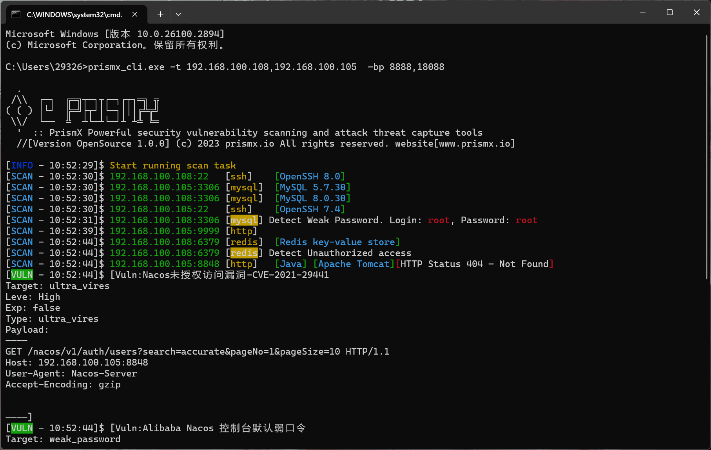
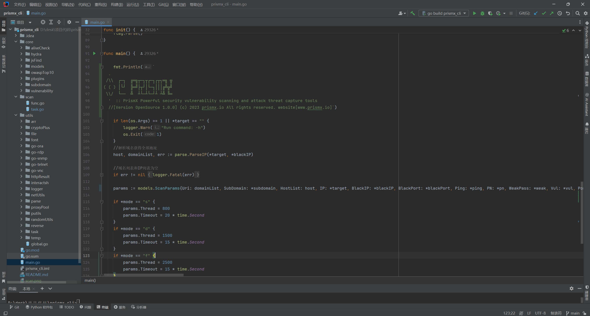

<h1 align="left">Prism X · Open Source</h1> 

<a href="README.md">`English`</a> • <a href="README_CN.md">`中文`</a> 

---

**Prism X integrates asset discovery, fingerprint recognition, weak password detection, and vulnerability verification, adopting a modular YAML plugin strategy configuration to achieve a PoC verification mechanism highly similar to real attack chains.**

- Cross-platform and lightweight design: Supports multiple operating systems, making it easy to deploy and use.
- Host and asset fingerprint recognition: Provides host survival scanning and asset fingerprint recognition functions to fully grasp the status of network assets.
- Weak password and vulnerability detection: Capable of identifying weak passwords and scanning for vulnerabilities to detect security risks in a timely manner and ensure system security.
- Built-in JNDI external link service: Supports scanning of vulnerabilities that require external connections, such as JNDI and RMI.
- Port fingerprint recognition framework: [**`yqcs/fingerscan`**](https://github.com/yqcs/fingerscan) 

 <h1 align="center">
    
</h1>

### Usage Command

```
Usage of prismx_cli.exe:

  -t  string
        Target hosts to scan, supporting formats like 192.168.1.1/24, 16, 8, 192.168.3.1-80, prismx.io, separated by commas.
  -p  string
        Ports to scan, supporting formats like 80,22,8000-8080.
  -bip  string
        Filter hosts, supporting IP ranges.
  -bp  string
        Filter ports, supporting port ranges.
  -m  string
        Scan speed, options: s (slow), d (medium), f (fast). Default is "d".
  -ping  boolean
        ICMP packets may not be sent under low privileges. Default is -ping=false.
  -pn  boolean
        Do not perform host survival detection. Default is -pn=false.
  -s  boolean   
        Enable online subdomain scanning. Default is -s=false.
  -vul  boolean
        Enable vulnerability detection. Default is -vul=true.
  -weak  boolean
        Enable weak password scanning. Default is -weak=true.
```

### Source Code Structure
<Tree> <ul> <li> core: System Core <ul> <li> aliveCheck: Host and port survival detection </li> <li> hydra: Weak password detection </li> <li> jsFind: Detection of sensitive content in JS files </li> <li> owaspTop10: Tools for detecting XSS, SQL injection, etc. (Not completed yet, needs further optimization) </li> <li> plugins: Plugin registration center and plugin files </li> <li> subdomain: Subdomain scanning </li> <li> vulnerability: Vulnerability detection module </li> <li> models: Dependencies for public modules </li> </ul> </li> <li> scan: Task scheduling center </li> <li> utils: Utility package <ul> <li>Task list</li> <li>Create new task</li> </ul> </li> <li> main.go: Program entry point </li> </ul> </Tree>

 <h1 align="center">
    
</h1>

### Build

Tips: It is recommended to use Golang version 1.20 for compilation (newer versions of Go no longer support Windows 7 and earlier versions).

```bash
  go build -ldflags "-s -w   -buildid=" -buildmode="pie"  -trimpath  
```

---

## [**`Customized: Prismx.io`**](https://prismx.io/)

 <h1 align="center"> 
<a href="https://prismx.io/"></a>

<a href="https://prismx.io/"></a>
</h1>

#### WeChat（left）| Follow（right）
 

